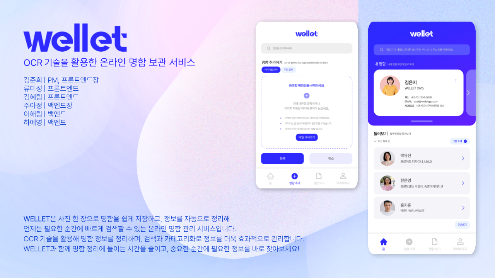

<div align="center">




</div>

## 🗂️ 목차

1. [**서비스 소개**](#1)
2. [**기능 설명**](#2)
3. [**프론트엔드 개발팀 소개**](#3)
4. [**기획 및 개발 기간**](#4)
5. [**개발 컨벤션**](#5)

<br>

<div id="1"></div>

## 💻 서비스 소개

명함을 받았지만 필요할 때 찾지 못해 당황한 경험이 있으신가요?<br> WELLET은 OCR 기술을 활용해 명함을 사진 한 장으로 쉽게 저장하고, 정보를 자동으로 정리하여 언제든지 빠르게 검색할 수 있는 온라인 명함 관리 서비스입니다.<br> 이제 중요한 순간에 필요한 정보를 손쉽게 찾아보세요!

[**🔗 서비스 바로 이용하기 Click !**](https://wellet.site/) <br>
[**🔗 시연 영상 바로가기 Click !**](https://youtube.com/shorts/G41Sa9YkV78?si=uDDjFwtNc9ZSYxWi) <br>
[**🔗 2024 APPS 온라인 전시회 바로가기 Click !**](https://2024-apps.netlify.app/projects/1) <br>
[**📋 서비스 설명 자료 보러가기 Click !**](https://drive.google.com/file/d/1-dwR3K-3QAp3l8WxaFevO4EhmJMrpTuY/view?usp=drive_link) <br>
[**📋 시스템 아키텍쳐 보러가기 Click !**](https://drive.google.com/file/d/1YA9soaWnrzCyfkDe7tlpCu9CV65oEK9M/view?usp=drive_link) <br>

<br>

<div id="2"></div>

## 💡 기능 설명

- 명함 사진 업로드<br>
  명함 사진을 업로드하면 자동으로 정보를 정리합니다.

- OCR로 정보 자동 추출<br>
  상호명, 이름, 전화번호, 주소 등 주요 정보를 OCR로 추출해 명함을 체계적으로 저장합니다.

- 세부설명 추가<br>
  직접 설명을 추가하여 명함과 관련된 기억을 보완하세요. (예: "OO 세미나 강사", "을지로 근처 디저트 맛집")

- 카테고리<br>
  거래처/학교/맛집 등 사용자 정의 카테고리로 정리해보세요.

- 명함 이미지 보관<br>
  명함의 앞면, 뒷면, 추가 이미지를 모두 보관합니다.

- 카테고리별 리스트로 정리<br>
  거래처, 친구, 맛집 등 카테고리별로 명함을 정리해 메인 화면에서 한눈에 확인할 수 있습니다.

- 검색 기능<br>
  상호명, 이름, 전화번호, 메모, 카테고리 등 기록된 내용을 기반으로 명함을 빠르게 검색할 수 있습니다.

<br>

<div id="3"></div>

## 💁🏻‍♀️ 프론트엔드 개발팀 소개

|                                                                               프로필                                                                               |       이름 (세부 전공)        |                                                                                                         개발 내용                                                                                                         |
| :----------------------------------------------------------------------------------------------------------------------------------------------------------------: | :---------------------------: | :-----------------------------------------------------------------------------------------------------------------------------------------------------------------------------------------------------------------------: |
| <a href="https://github.com/junheekim61" target="_blank"></a> |   김준희<br>(컴퓨터과학 22)   |                                      <p style="text-align:left;">- 온보딩 페이지 구현<br>- 카카오톡 로그인 기능 및 페이지 구현<br>- 홈 화면 페이지 구현<br>- 그룹 수정 모달 구현</p>                                      |
| <a href="https://github.com/kimhyerims" target="_blank"></a>  | 김혜림<br>(데이터사이언스 23) |                                                    <p style="text-align:left;">- 명함 상세 보기 및 수정하기 페이지 구현<br>- 내 명함 보기 및 수정하기 페이지 구현</p>                                                     |
| <a href="https://github.com/misung-dev" target="_blank"></a>  |   류미성<br>(컴퓨터과학 21)   | <p style="text-align:left;">- Header, 검색창, Tab bar 등 컴포넌트 구현<br>- 명함 추가 페이지 구현 (OCR 기능 연동을 통해 명함 사진 추가, 직접 입력 추가)<br>- 그룹별 명함 보기 페이지 구현<br>- 내 명함 공유 모달 구현</p> |

<br>

<div id="4"></div>

## 📅 기획 및 개발 기간

2024년 3월 ~ 2025년 3월 (13개월)

<br>

<div id="5"></div>

## 💪 개발 컨벤션

### 🟣 Commit Convention

- `[FEAT]`: 새로운 기능 구현
- `[FIX]`: 버그 및 오류 수정
- `[DOCS]`: 문서 수정 (README.md 등)
- `[DESIGN]`: CSS 등 사용자 UI 디자인 변경
- `[STYLE]`: 코드 포맷 변경, 세미 콜론 누락, 코드 수정이 없는 경우
- `[MOVE]`: 프로젝트 파일 및 코드 이동
- `[REMOVE]`: 불필요한 코드 및 파일을 삭제
- `[RENAME]`: 파일 및 폴더명을 변경
- `[REFACTOR]`: 코드 리팩터링
- `[COMMENT]`: 필요한 주석 추가 및 변경
- `[!HOTFIX]`: 급하게 치명적인 버그를 고쳐야하는 경우
- `[!BREAKING CHANGE]`: 커다란 API 변경의 경우
- `[TEST]`: 테스트 추가, 테스트 리팩토링(프로덕션 코드 변경 X)
- `[CHORE]`: 빌드 태스트 업데이트, 패키지 매니저를 설정하는 경우(프로덕션 코드 변경 X)

#### 커밋 메세지 예시

- git commit -m "#이슈 번호 [커밋 태그] 커밋 내용"
  - `ex ) git commit -m "#1 [FEAT] 회원가입 기능 완료"`

<br>

### 🟣 Branch Convention

- `[MAIN]` : 출시 가능한 프로덕션 코드를 모아두는 브랜치
- `[DEV]` : feat에서 기능 개발이 끝난 후 다음 버전 개발을 위한 코드를 모아두는 브랜치
- `[FEATURE]` : 하나의 기능을 개발하기 위한 브랜치, 기능개발 완료되면 develop 브랜치로 머지
- `[FIX]` : 에러 수정, 버그 수정
- `[DOCS]` : README, 문서
- `[REFACTOR]` : 코드 리펙토링 (기능 변경 없이 코드만 수정할 때)
- `[MODIFY]` : 코드 수정 (기능의 변화가 있을 때)
- `[CHORE]` : gradle 세팅, 위의 것 이외에 거의 모든 것

#### Branch Naming 예시

- feat/#이슈 번호-기능 이름
  - `ex) feat/#1-login`

<br>

### 🟣 Git Flow

기본적으로 Git Flow 전략을 이용한다. Fork한 후 나의 repository에서 작업하고 구현 후 원본 repository에 pr을 날린다. 작업 시작 시 선행되어야 할 작업은 다음과 같다.

```java
1. Issue를 생성한다.
2. feature Branch를 생성한다.
3. Add - Commit - Push - Pull Request 의 과정을 거친다.
4. Pull Request가 작성되면 작성자 이외의 다른 팀원이 Code Review를 한다.
5. Code Review가 완료되면 Pull Request 작성자가 develop Branch로 merge 한다.
6. merge된 작업이 있을 경우, 다른 브랜치에서 작업을 진행 중이던 개발자는 본인의 브랜치로 merge된 작업을 Pull 받아온다.
7. 종료된 Issue와 Pull Request의 Label과 Project를 관리한다.
```

- 기본적으로 git flow 전략을 사용합니다.
- main, dev, feature 3가지 branch 를 기본으로 합니다.
- main → dev → feature. feature 브랜치는 feat/기능명으로 사용합니다.
- 이슈를 사용하는 경우 브랜치명을 feat/[issue num]-[feature name]로 합니다.

<br>

### 🟣 Issue Convention

- `[FEAT]` : 기능 추가
- `[FIX]` : 에러 수정, 버그 수정
- `[DOCS]` : README, 문서
- `[REFACTOR]` : 코드 리펙토링 (기능 변경 없이 코드만 수정할 때)
- `[MODIFY]` : 코드 수정 (기능의 변화가 있을 때)
- `[CHORE]` : gradle 세팅, 위의 것 이외에 거의 모든 것

#### Issue Naming 예시

- [이슈 태그] 작업 내용
  - `ex) [FEAT] user api 구현`
